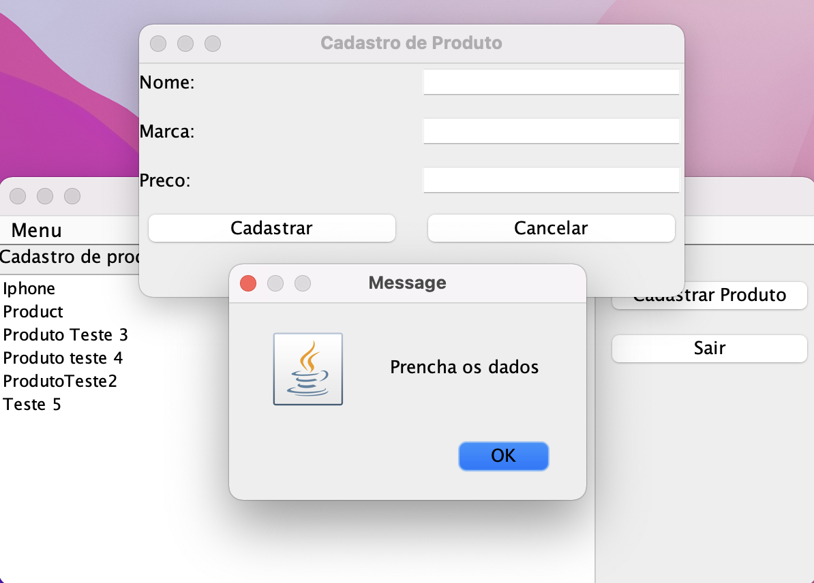

# Cadastro de Produtos com Java

Projeto realizado no Netbeans, utiliza a linguagem JAVA e na tela inicial disponibiliza um menu para iniciar o cadastro de um produto.

Na Tela Principal aparecem listados os produtos já cadastrados.

Quando seleciona a opcao "Cadastrar Menu" a janela de cadastro é aberta.

O sistema faz a verificacao e se algum campo estiver vazio ele dispara a caixa de diálogo com o aviso para inserir os dados.

Inserindo todos os dados e clicando no botao "Cadastrar" o produto é salvo no bando de dados. Aparece entao a mensagem dizendo que o produto foi cadastrado com sucesso e os detalhes inseridos.

Na proxima vez que abrir o ultimo produto cadastrado ja aparece na lista de produtos salvos.

## Tecnologias
- Java 20
- MySQL
- MySQL connector 8.0.32.jar

## Instrucoes

* Voce precisa incluir uma conexao ao seu banco de dados dentro de Service > Databases

* Dentro do arquivo DAOCadastroProdutos na classe principal inserir os dados da sua conexao.
host = por padrao é "localhost"
db = "O nome do seu bando de dados"
user = por padrao é "root"
pwd = a senha do seu banco de dados.

